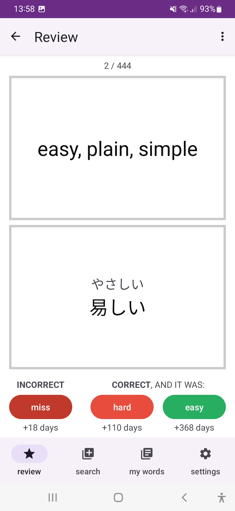
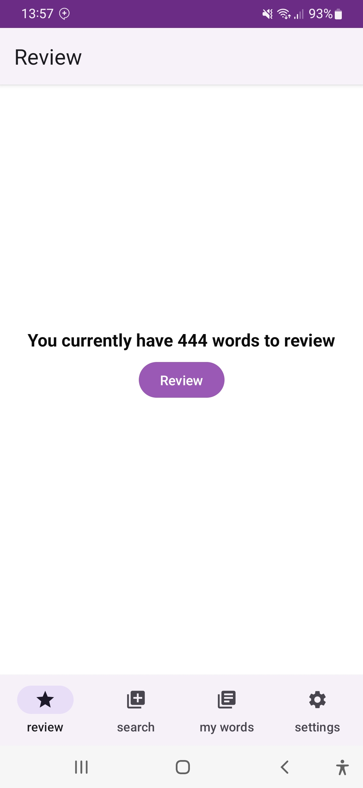
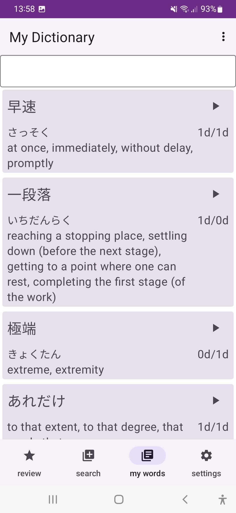
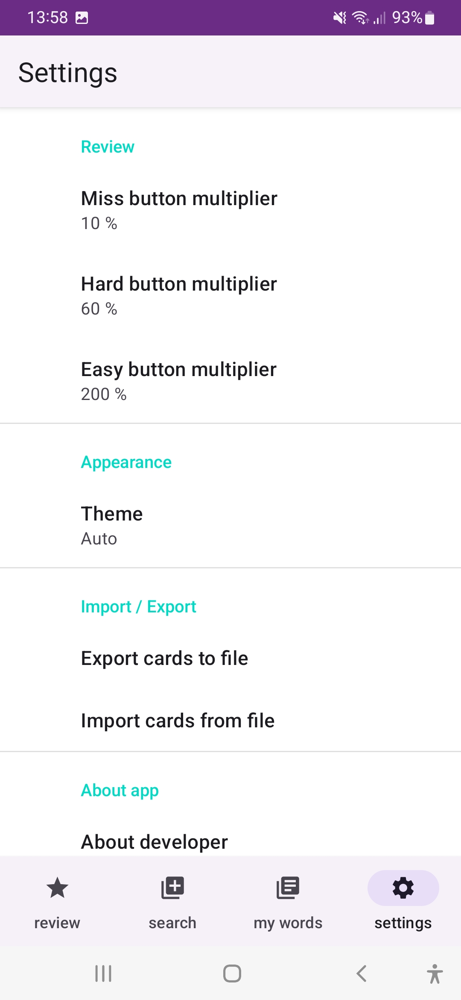

# JpCards - Japanese Flashcards

An application for studying Japanese words using flashcards.

Existing features:
---------
- [x] Search words in the Internet and add them to your dictionary.
- [x] Study and review words offline.
- [x] Import and export your progress to/from csv file.
- [x] Night Mode
- [x] Text-to-speech integration.
- [ ] Use premade sets of words.

Install
---------

<a href="https://play.google.com/store/apps/details?id=com.kirillemets.flashcards">
    
        
Screenshots:
---------

  
 Details 

  
  
  
  
  

Used technologies:
---------
- Most of Jetpack libraries: Lifecycle (ViewModel + Flow), Navigation, Material UI, Room, Hilt.
- Constraint Layout
- Recycler View
- Jetpack Compose
- Retroit2 + Moshi
- MVVM Architecture + Clean Architecture
